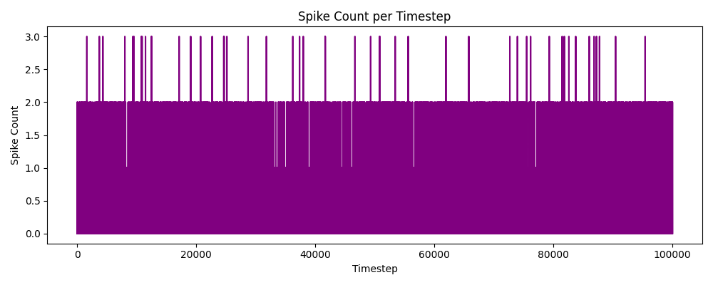
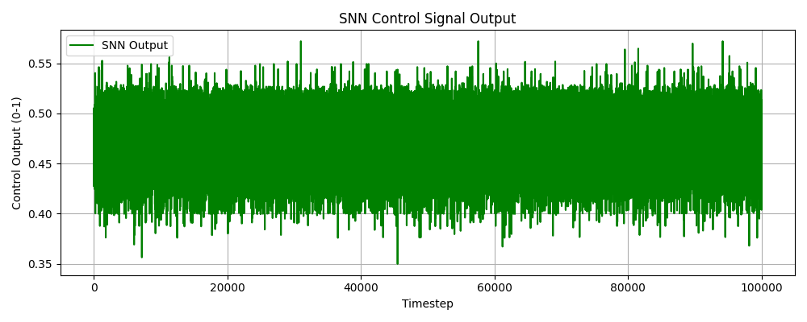
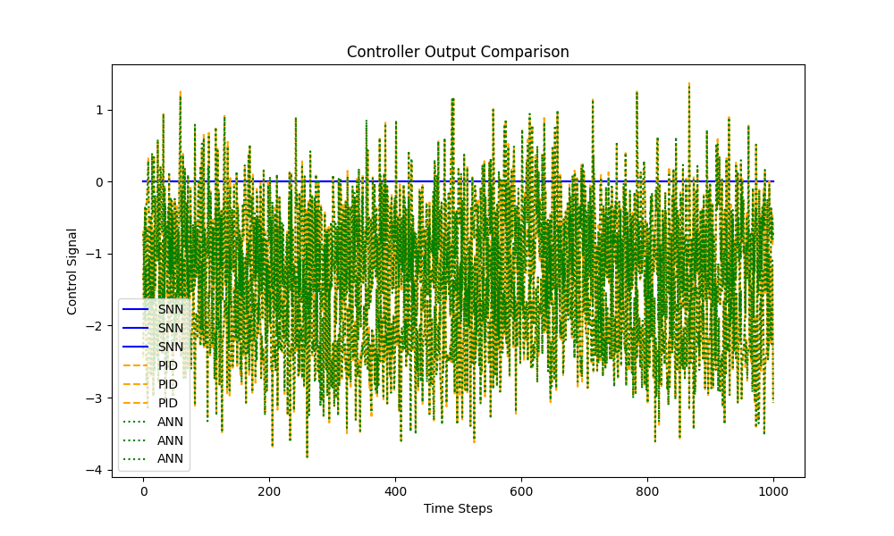

# NeuroMold Project Report

**Date:** 2025-04-06 13:06:42

## Overview

NeuroMold is a neuromorphic automation system for the injection molding industry, using Spiking Neural Networks (SNNs) to optimize process control and defect reduction.

---

## Metrics Summary

- ✅ **SNN Response Accuracy:** 0.7540
- 🔋 **Average Spikes per Timestep:** 0.921

---

## Visualizations

### Spike Rates  

### Control Signals from SNN  

### Membrane Potentials (sample)  

### Controller Comparison  

---

## Energy Estimation

Energy consumption is estimated based on total spike activity:

- Spike count-based energy model:  
  _E = Total Spikes × 0.25 µJ_

  (Simulation-based estimate)

---

## Conclusion

SNN-based control shows promising accuracy and efficiency for real-time control in injection molding. Future steps include:

- Integrating real-world sensor data
- Hardware deployment using neuromorphic chips
- Expanding to multimodal defect detection

---

*Generated by NeuroMold automation pipeline*
